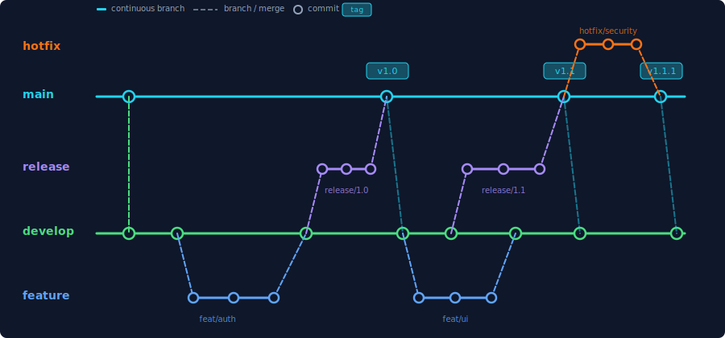

# Gitflow Workflow

| Field        | Value      |
| ------------ | ---------- |
| Type         | Guide      |
| Status       | Active     |
| Last Updated | 2026-03-24 |

---

## Overview

This project uses the Gitflow branching model for release management. Gitflow provides a structured workflow that separates ongoing development from release preparation, making it straightforward to maintain production code while building new features.

## Branch Structure



| Branch      | Purpose                 | Created From | Merges Into        |
| ----------- | ----------------------- | ------------ | ------------------ |
| `main`      | Production-ready code   | --           | --                 |
| `develop`   | Integration branch      | `main`       | --                 |
| `feat/*`    | New features            | `develop`    | `develop`          |
| `fix/*`     | Bug fixes               | `develop`    | `develop`          |
| `release/*` | Release preparation     | `develop`    | `main` + `develop` |
| `hotfix/*`  | Urgent production fixes | `main`       | `main` + `develop` |

## Feature Development

### Starting a Feature

```bash
# Create feature branch from develop
git checkout develop
git pull origin develop
git checkout -b feat/my-feature
```

### Working on a Feature

```bash
# Make changes, commit with conventional commits
git add .
git commit -m "feat(scope): add new capability"

# Keep up to date with develop
git fetch origin
git rebase origin/develop
```

### Completing a Feature

```bash
# Push and create a pull request into develop
git push origin feat/my-feature

# After PR approval, merge with --no-ff to preserve history
git checkout develop
git merge --no-ff feat/my-feature
git branch -d feat/my-feature
git push origin develop
```

## Release Process

### Automated Release (Recommended)

The included release script handles the entire flow:

```bash
bash scripts/release.sh
```

The script will:

1. Verify you are on `develop` with a clean working tree
2. Prompt for release type (major / minor / patch)
3. Create a `release/X.Y.Z` branch
4. Bump `package.json` version
5. Run tests and build
6. Generate AI-powered changelog
7. Pause for your review
8. Merge into `main`, tag, and merge back to `develop`

### Manual Release

If you prefer to release manually:

```bash
# 1. Create release branch
git checkout develop
git checkout -b release/1.2.0

# 2. Bump version
npm version 1.2.0 --no-git-tag-version
git add package.json
git commit -m "chore(release): bump version to 1.2.0"

# 3. Run checks
pnpm test
pnpm build

# 4. Update CHANGELOG.md, then commit
git add CHANGELOG.md
git commit -m "docs(changelog): add 1.2.0 release notes"

# 5. Merge into main
git checkout main
git merge --no-ff release/1.2.0 -m "release: merge release/1.2.0 into main"

# 6. Tag
git tag -a v1.2.0 -m "Release 1.2.0"

# 7. Merge back into develop
git checkout develop
git merge --no-ff main -m "chore: merge main back into develop after v1.2.0"

# 8. Clean up
git branch -d release/1.2.0

# 9. Push everything
git push origin main develop v1.2.0
```

## Hotfix Process

For urgent fixes that cannot wait for the next release:

```bash
# 1. Branch from main
git checkout main
git checkout -b hotfix/security-patch

# 2. Fix, test, bump patch version
# ... make changes ...
npm version patch --no-git-tag-version
git add -A
git commit -m "fix(security): patch vulnerability in auth flow"

# 3. Merge into main and tag
git checkout main
git merge --no-ff hotfix/security-patch
git tag -a v1.2.1 -m "Hotfix 1.2.1"

# 4. Merge into develop
git checkout develop
git merge --no-ff main

# 5. Clean up and push
git branch -d hotfix/security-patch
git push origin main develop v1.2.1
```

## Commit Message Format

Use [Conventional Commits](https://www.conventionalcommits.org/):

```text
<type>(<scope>): <subject>
```

| Type       | When                         |
| ---------- | ---------------------------- |
| `feat`     | New feature                  |
| `fix`      | Bug fix                      |
| `docs`     | Documentation only           |
| `style`    | Formatting (no logic change) |
| `refactor` | Code change (no feature/fix) |
| `test`     | Adding or updating tests     |
| `chore`    | Build, CI, tooling changes   |
| `perf`     | Performance improvement      |

Rules:

- Subject line: imperative mood, lowercase, no trailing period, max 50 characters
- Body: wrap at 70 characters, explain what and why (not how)
- Reference task IDs when applicable

## Version Numbering

This project follows [Semantic Versioning](https://semver.org/):

| Component | When to Increment                  | Example            |
| --------- | ---------------------------------- | ------------------ |
| Major     | Breaking changes to public API     | `1.0.0` -> `2.0.0` |
| Minor     | New features, backwards compatible | `1.0.0` -> `1.1.0` |
| Patch     | Bug fixes, no new features         | `1.0.0` -> `1.0.1` |

## Changelog

The project includes an AI-powered changelog generator:

```bash
# Generate and write to CHANGELOG.md
bash scripts/changelog.sh

# Preview without writing
bash scripts/changelog.sh --dry-run
```

The generator reads commits between tags, sends them to Claude or ChatGPT, and produces a summary paragraph followed by a technical breakdown (Added, Changed, Fixed, etc.).

Requires `ANTHROPIC_API_KEY` or `OPENAI_API_KEY` in `.env`, plus `jq` and `curl`.

## Scripts Reference

| Script                  | Purpose                                  |
| ----------------------- | ---------------------------------------- |
| `scripts/release.sh`    | Interactive Gitflow release orchestrator |
| `scripts/changelog.sh`  | AI-powered release notes generator       |
| `scripts/prepublish.sh` | Pre-publish safety checks                |

## Tips

- Always use `--no-ff` when merging to preserve branch history in the graph
- Keep feature branches short-lived (days, not weeks) to reduce merge conflicts
- Rebase feature branches on `develop` regularly to stay current
- Never commit directly to `main` or `develop` -- always use branches
- Delete merged branches promptly to keep the repository tidy
- Tag every release on `main` with the `v` prefix (`v1.2.0`)

---

```text
Copyright (C) {{YEAR}} {{COPYRIGHT_HOLDER}}. All rights reserved.
```
